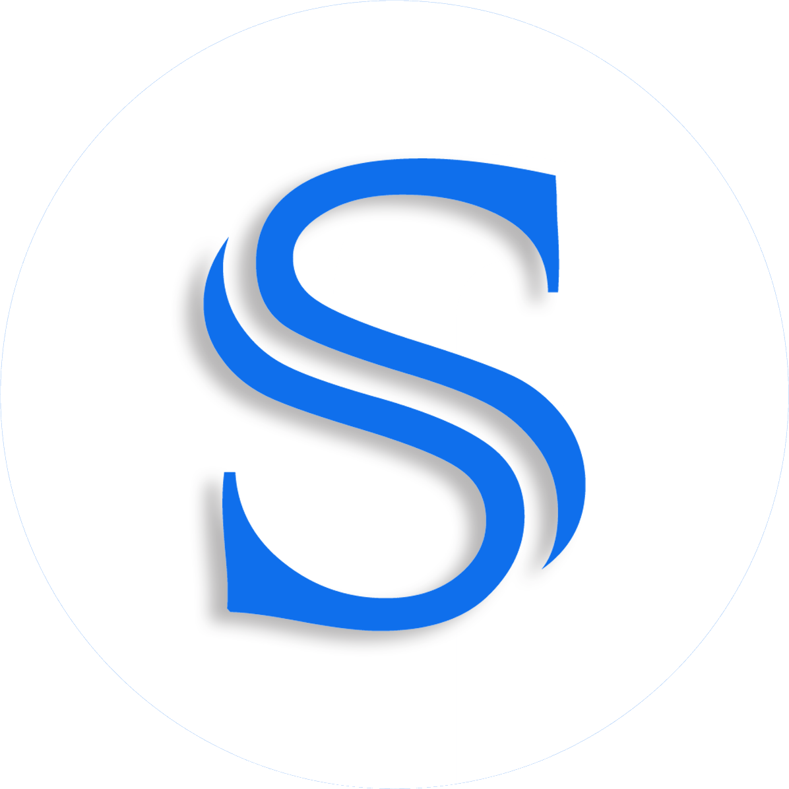
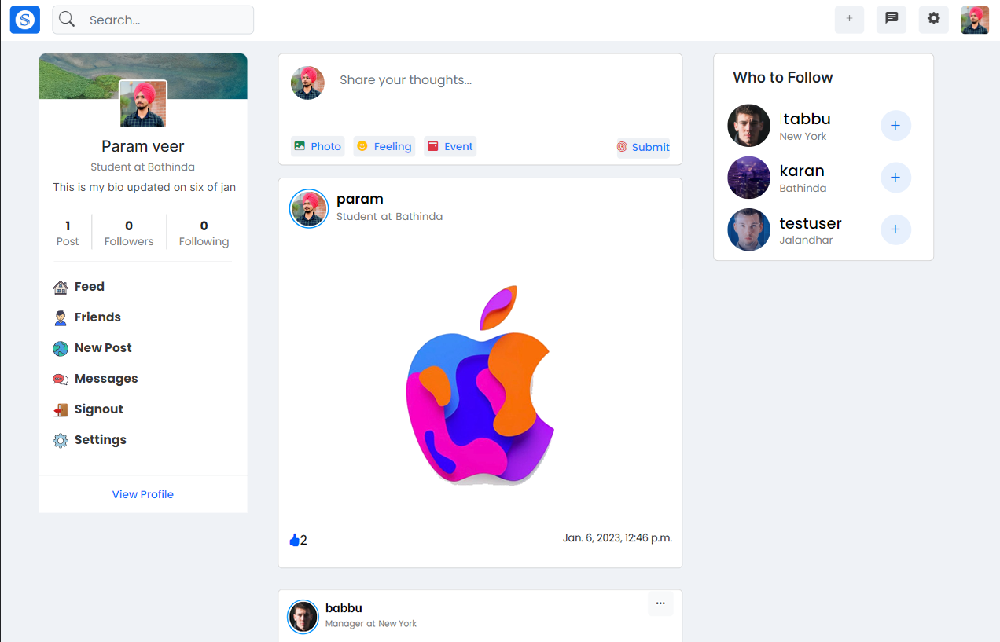
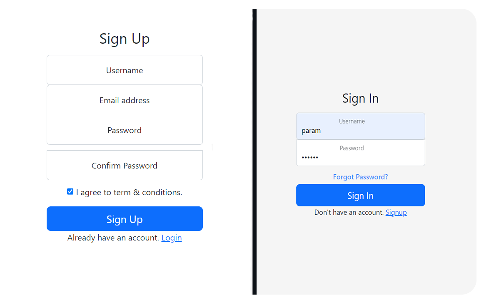
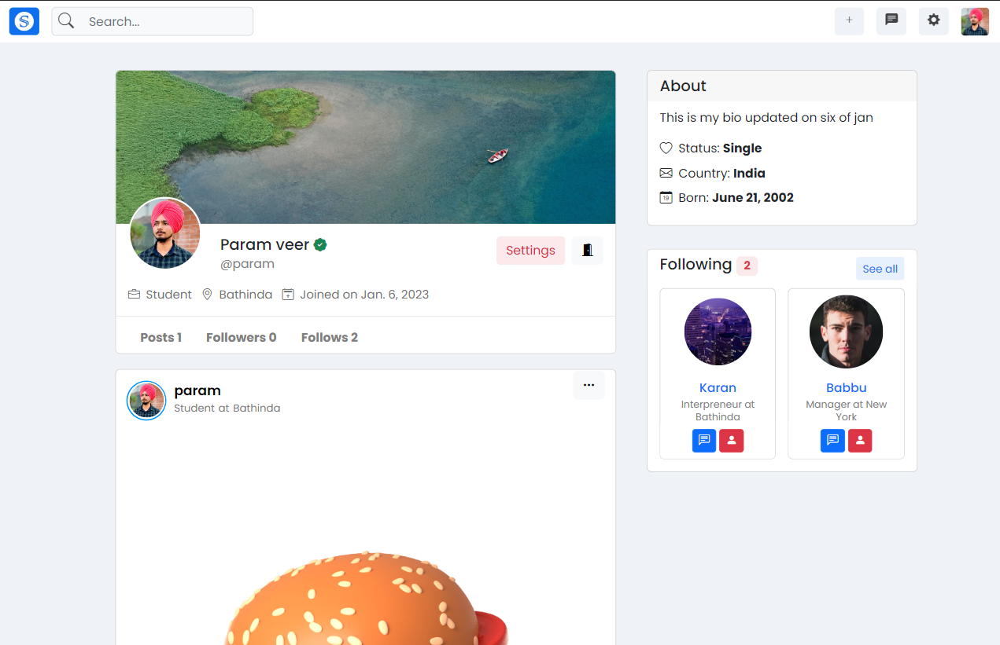
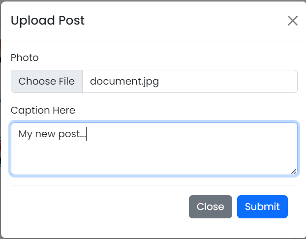
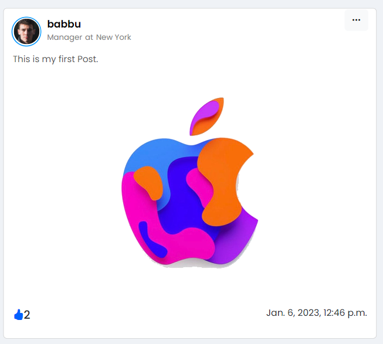
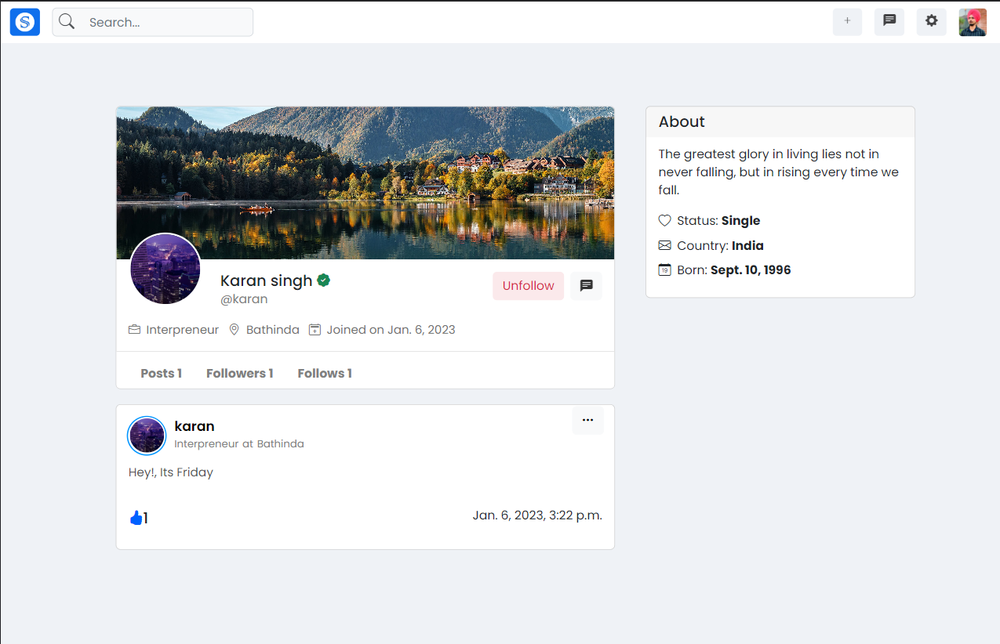
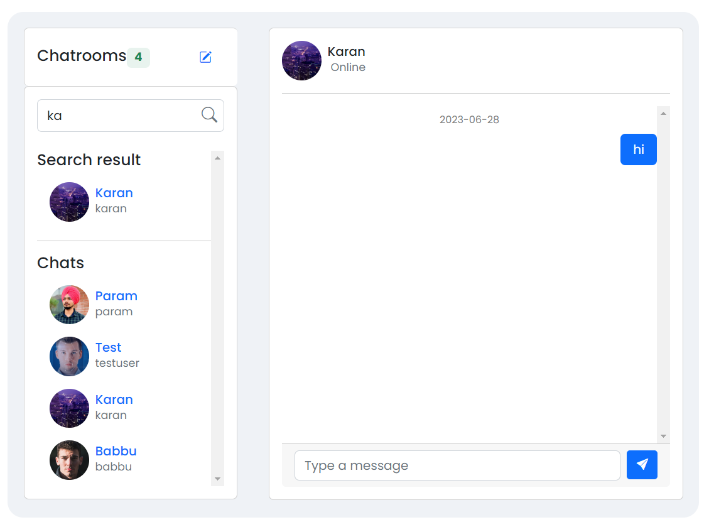
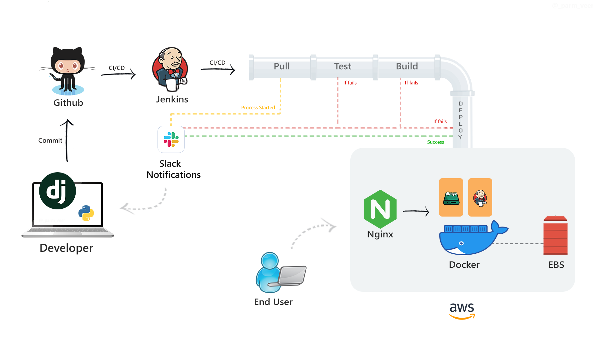

# Social media web app with CI/CD
Introducing a Django social media web application with CI/CD using Jenkins. A user-friendly social media platform is created using the Django framework and Jenkins automation in this project.  With features like user profiles, posts, and interactions, it offers a seamless experience for connecting and sharing. The CI/CD pipeline ensures smooth deployment, making it easy to maintain and update the application.

## Table of Contents

- [Introduction](#introduction)
- [Installation](#installation)
- [Usage](#usage)
- [Contributing](#contributing)
- [CI/CD Architecture](#cicd)


  

# Socialbook 


Socialbook is a web application built with Django that allows users to connect and share their memories with others. It provides features such for profile management, photo posting, liking, making friends and chat functionality.

  

## Features

- **Signup with Email OTP Verification**: Users can sign up for an account using their email address and complete the verification process using a One-Time Password (OTP) sent to their email.

 

- **Profile Section**: Once registered, users have their own profile section where they can manage their personal information, such as username, profile picture, bio, and other details.

 


- **Posts**: Users can upload and share their photos with the community. They can provide captions and even can delete any time their posts.

 

- **Likes**: Users can express their appreciation for posts by liking them. The number of likes is displayed on each post, Date and time of post is shown in right side of likes.

 

- **Follow/Unfollow**: Users can follow other users to stay updated with their posts. They can also unfollow users if they no longer wish to see their content.

 

- **Chat**: The website provides a real-time chat feature that allows users to communicate with each other. Users can send and receive text messages in this application.




# Installation

To run the project locally, follow these steps:

## Requirements
Before running the application, make sure you have the following requirements met:

`Python 3.9` or higher: Ensure that Python is installed on your system. You can download Python from the official Python website: https://www.python.org/ .

1. Clone the repository to your local machine:

   ```bash
   git clone https://github.com/paramsgit/Socialbook.git
   ```

2. Navigate to the project directory:

   ```bash
   cd Socialbook\sclone
   ```

3. Create a virtual environment (optional but recommended):

   ```bash
   pip install virtualenv 
   python -m venv env
   \env\Scripts\activate
   ```

4. Install the project dependencies:

   ```bash
   pip install -r requirements.txt
   ```

5. Set up the database:

   ```bash
   python manage.py migrate
   ```

6. Start the development server:

   ```bash
   python manage.py runserver
   ```

7. Access the website locally by visiting [http://localhost:8000](http://localhost:8000) in your web browser. Complete configurations first to avoid any errors.

## Configuration

The application requires some configuration settings to function correctly. You can modify these settings in the `settings.py` file located in the project's root directory. Here are some important settings you might want to customize:


- `DATABASES`: Configure the database settings according to your setup (e.g., PostgreSQL, MySQL, SQLite).
You can download my database file and media here : https://drive.google.com/file/d/1SpW0uBAvFXn5lKZlhkka-hgBomCtOq-h/view?usp=sharing/ . Update database and media path in `settings.py` file.


- `EMAIL_BACKEND`: Specify the email backend for sending verification emails. You can use SMTP, a transactional email service like SendGrid, or any other supported backend.


- `MEDIA_ROOT` and `MEDIA_URL`: Set the path where user-uploaded media files will be stored and served.


Please make sure to secure sensitive information, such as secret keys, database credentials, and API tokens, by using environment variables or other secure methods.

## Contributing

Contributions to this project are welcome. If you have any ideas, suggestions, or bug reports, please open an issue on the project's GitHub repository and describe your proposal. You can also submit a pull request to contribute code improvements.


## Acknowledgements


This project was developed using the Django web framework. We would like to acknowledge the Django community for their excellent work and documentation that helped us build this application.


#

# Continuous Integration and Continuous Deployment

In this architecture, an AWS EC2 instance is utilized to set up two containers. The first container hosts the Django application, while the second container runs Jenkins. With this setup, whenever code is pushed to GitHub, Jenkins automatically triggers the testing, building, and deployment processes, ensuring seamless integration and delivery of updates to the Django app running in the first container. The use of Docker enables efficient containerization and isolation of the application components.

 

#
# Django Web App CI/CD with Jenkins


## Prerequisites

Before you proceed, make sure you have the following prerequisites:

- Django framework installed
- Jenkins installed and configured
- Git repository for your Django web app

## Installation

To set up the CI/CD pipeline for your Django web app, follow these steps:

1. Clone the Git repository for your Django web app and setup django app as described above.

2. Set up a Jenkins Job : 
On the new job page, name the item Django-app and choose Multibranch pipeline.On the configuration page, click on Add source and choose Git. Fill in the details of your repository in Github. Then, check Periodically.Click Save.

3. Navigate to Jenkins root -> Django-app-> master and once there click on Build now to start a build manually.

## Configuration

The CI/CD pipeline can be configured through the following files and settings:

- `Jenkinsfile`: Contains the declarative pipeline configuration for Jenkins.
- `requirements.txt`: Lists the dependencies required by your Django web app.
- `settings.py`: Includes the configuration settings for your Django application.

Make sure to update these files according to your project structure and requirements.

## Usage

To trigger the CI/CD pipeline and deploy your Django web app, follow these steps:

1. Push your code changes to the Git repository.
2. Jenkins will automatically detect the changes and trigger the pipeline.
3. Jenkins will build, test, and deploy the application based on your pipeline configuration.
4. Monitor the pipeline execution in the Jenkins dashboard.


## Contact

If you have any questions or need further assistance, feel free to contact us at your-email@example.com.
